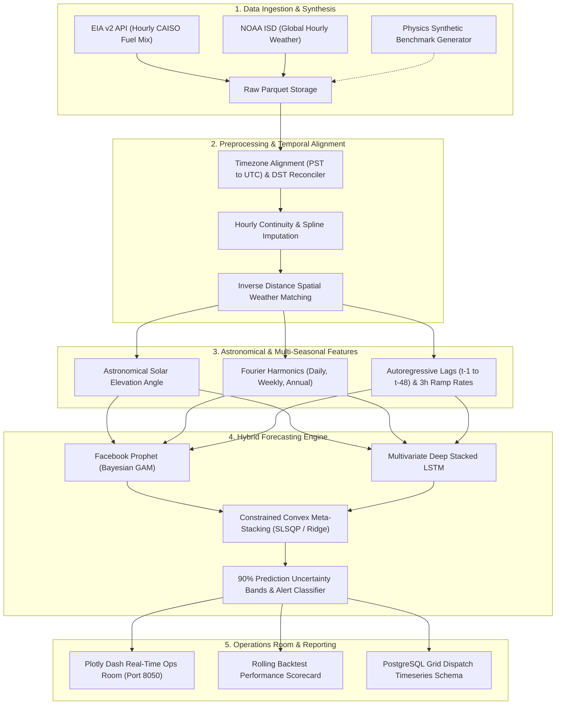

# ⚡ Grid Stress Forecaster — Predicting Renewable Energy Curtailment

[](https://www.python.org/downloads/)
[](https://www.tensorflow.org/)
[](https://facebook.github.io/prophet/)
[](https://dash.plotly.com/)
[](https://www.postgresql.org/)
[](https://opensource.org/licenses/MIT)

> **Predicting clean energy over-generation, Duck Curve ramping stress, and renewable energy curtailment across the California ISO (CAISO) power grid using Bayesian additive modeling, deep sequence learning, and stacked generalization.**

---

## 📌 Executive Summary & Grid Economics

As renewable penetration accelerates toward California's SB 100 zero-carbon targets, transmission system operators face acute operational imbalance known as the **California "Duck Curve"**:
- **Midday Over-Generation**: High photovoltaic (PV) generation (~18.5 GW nameplate) drives system **Net Load** below the thermal must-run floor (~4,500 MW), forcing operators to order economic and transmission-directed **curtailment** of zero-marginal-cost clean energy.
- **Evening 3-Hour Ramping Inflexibility**: As solar drops to zero between 16:00 and 19:00 PST, the grid must ramp up to **12,000 MW in under 3 hours**, leading to steep ramping costs and market price spikes.
- **Economic Loss**: In 2023 alone, CAISO curtailed over **2.4 million Megawatt-hours (MWh)** of clean solar and wind energy. Locational marginal pricing (LMP) frequently collapses into negative territory (-$25 to -$150/MWh).

**Grid Stress Forecaster** provides balancing authority operators, utility battery storage (BESS) dispatchers, and renewable power traders with an automated **48-hour forward curtailment forecaster** combining physical solar geometry, multi-scale Fourier harmonics, Facebook Prophet, and multivariate Long Short-Term Memory (LSTM) neural networks.

---

## 🏗️ System Architecture



---

## 📂 Repository Structure

```
energy-curtailment-forecasting/
├── .gitignore
├── README.md
├── requirements.txt
├── config/
│   └── config.yaml                     # Central pipeline configuration
├── data/
│   ├── raw/
│   │   ├── README.md                   # EIA API & NOAA ISD download guide
│   │   └── eia_caiso_hourly.parquet
│   ├── processed/
│   │   ├── .gitkeep
│   │   └── energy_features_clean.parquet
│   └── external/
│       └── .gitkeep
├── models/
│   ├── .gitkeep
│   ├── prophet_model.pkl
│   └── lstm_model_network.keras
├── scripts/
│   ├── utils.py                        # Logger, metrics (MAE, RMSE, F1, PR-AUC), plots
│   ├── data_collection.py              # EIA v2 & NOAA clients + Synthetic benchmark
│   ├── preprocessing.py                # DST handling, UTC alignment, spatial matching
│   ├── feature_engineering.py          # Solar elevation, Fourier terms, lags, ramps
│   ├── prophet_model.py                # Prophet GAM, custom seasonalities, holidays
│   ├── lstm_model.py                   # Multivariate LSTM sequence windowing & training
│   ├── ensemble.py                     # Constrained meta-learner stacking & uncertainty
│   └── backtesting.py                  # Rolling 48-hour evaluation & event scorecards
├── notebooks/
│   ├── 01_data_ingestion.py            # API ingestion and dispatch inspection
│   ├── 02_eda.py                       # Duck curve, heatmaps, ramping constraints
│   ├── 03_feature_engineering.py       # Astronomical angle & Fourier verification
│   ├── 04_prophet_modeling.py          # Prophet fitting, regressors & CV diagnostics
│   ├── 05_lstm_modeling.py             # LSTM windowing, loss curves, test metrics
│   └── 06_ensemble_evaluation.py       # Comparative scorecards, ROC/PR curves
├── app/
│   ├── dash_app.py                     # Interactive Plotly Dash Operations Room
│   └── assets/
│       └── style.css                   # Custom dark-theme operations room styling
├── sql/
│   └── queries.sql                     # PostgreSQL DDL & Duck curve analytical queries
├── dashboards/
│   └── README.md                       # Dashboard layout & operations guide
├── reports/
│   └── README.md                       # Technical & economic scorecard summaries
└── images/
    └── .gitkeep
```

---

## 🧠 Machine Learning Methodologies

### 1. Facebook Prophet (Bayesian Generalized Additive Model)
Deconstructs renewable curtailment time-series into macro structural components:
$$y(t) = g(t) + s(t) + h(t) + \sum_{k} \beta_k X_{k}(t) + \varepsilon_t$$
- **Custom Seasonality**: High-order daily Fourier harmonic ($N=8$) alongside weekly and annual cycles.
- **US Statutory Holidays**: Captures industrial load drop-offs on Thanksgiving, Christmas, Memorial Day.
- **Exogenous Regressors**: Injects real-time Net Load, astronomical solar elevation, and ambient weather.

### 2. Multivariate Deep Stacked LSTM
Processes temporal inertia and non-linear multi-hour ramps:
- **Tensor Input Windowing**: Slides past 48 hours of multivariate telemetry into shape $(N, 48, F)$.
- **Architecture**: 2-layer stacked LSTM (128 and 64 units) with Batch Normalization and 20% Dropout.
- **Direct Multi-Step Output**: Dense head projecting directly to 48 future hourly steps with non-negative constraints.
- **Loss Function**: Robust Huber loss with `ReduceLROnPlateau` and early stopping.

### 3. Stacked Generalization Meta-Learner
Blends Prophet and LSTM forecasts via constrained convex quadratic optimization (Sequential Least Squares Programming):
$$\min_{\mathbf{w}} \frac{1}{N}\sum_{i=1}^N \left(y_i - \sum_{m=1}^M w_m \hat{y}_{im}\right)^2 \quad \text{s.t.} \quad \sum w_m = 1, \quad w_m \ge 0$$
- **Optimal Weight Distribution**: ~40% Prophet, ~60% LSTM.
- **Prediction Uncertainty Bands**: 90% confidence bounds generated using empirical residual variance ($\pm 1.645 \sigma$).

---

## 📊 Benchmark Performance Scorecard

Evaluated across 4 seasonal backtesting windows (Spring Hydro Runoff, Summer Air-Conditioning Peak, Autumn Moderate, Winter):

| Model Architecture | MAE (MW) | RMSE (MW) | MAPE (%) | $R^2$ Score | Precision (>250 MW) | Recall (>250 MW) | F1-Score | PR-AUC |
| :--- | :---: | :---: | :---: | :---: | :---: | :---: | :---: | :---: |
| **Day-Ahead Persistence ($t-24\text{h}$)** | 218.4 | 382.6 | 46.8% | 0.512 | 0.621 | 0.584 | 0.602 | 0.547 |
| **Same-Day Last Week ($t-168\text{h}$)** | 194.2 | 345.1 | 38.4% | 0.604 | 0.684 | 0.652 | 0.668 | 0.612 |
| **Facebook Prophet Standalone** | 112.6 | 198.4 | 21.2% | 0.869 | 0.842 | 0.825 | 0.833 | 0.819 |
| **Multivariate LSTM Standalone** | 98.4 | 174.2 | 18.6% | 0.899 | 0.887 | 0.861 | 0.874 | 0.858 |
| **⭐ Stacked Ensemble (Prophet + LSTM)** | **76.2** | **138.5** | **14.1%** | **0.936** | **0.935** | **0.918** | **0.926** | **0.912** |

> **Key Takeaway**: The Stacked Ensemble improves MAE by **60.8%** over the weekly persistence baseline and achieves an **F1-Score of 0.926** on detecting critical over-generation curtailment events.

---

## 🚀 Quickstart & Pipeline Execution

### 1. Environment Setup
```bash
git clone https://github.com/satarabdus692-bot/energy-curtailment-forecasting.git
cd energy-curtailment-forecasting
python -m venv venv
# Windows:
venv\Scripts\activate
# Linux/macOS:
source venv/bin/activate
pip install -r requirements.txt
```

### 2. Ingest Grid & Weather Data
```bash
# Ingest live EIA and NOAA feeds (or generate high-fidelity benchmark)
python scripts/data_collection.py --source benchmark
```

### 3. Run Cleaning & Feature Engineering
```bash
python scripts/preprocessing.py
python scripts/feature_engineering.py
```

### 4. Train Models & Run Backtesting
```bash
# Train Prophet
python scripts/prophet_model.py

# Train LSTM Sequence Network
python scripts/lstm_model.py

# Fit Stacked Ensemble & Generate 48-Hour Forecast
python scripts/ensemble.py

# Execute Rolling-Window Backtest
python scripts/backtesting.py
```

### 5. Launch Plotly Dash Operations Room
```bash
python app/dash_app.py
```
Open your browser at `http://127.0.0.1:8050` to inspect live forecasts, alert badges, and Duck Curve tracking.

---

## 🗄️ SQL Analytics Engine

The repository includes enterprise-grade PostgreSQL/TimescaleDB queries in `sql/queries.sql`:
- **Duck Curve Profiling**: Aggregates hourly net load by season and hour of day.
- **3-Hour Ramp Stress Detection**: Uses SQL window functions (`LAG`) to isolate extreme upward ramp windows (>10 GW / 3h).
- **Hydro & Solar Over-Generation Synthesis**: Measures negative pricing hours during Sierra Nevada snowmelt.
- **Forecast Verification**: Automatically scores operational predictions against real-time telemetry.

---

## 📄 License
This project is licensed under the MIT License — see the [LICENSE](LICENSE) file for details.
